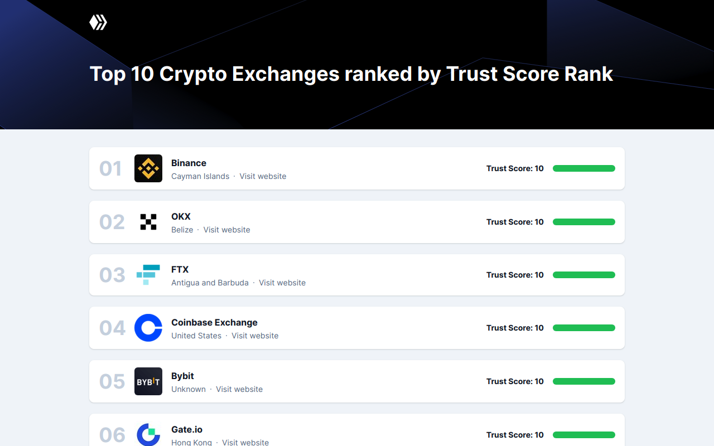

# Test task for stakefish company

Using the Coingecko public API (https://www.coingecko.com/en/api), build an application that will serve as a directory of cryptocurrency exchanges. The main page should be a list with the first ten exchanges with some high-level information (name, country, URL, logo, trust rank).

When the user clicks on an exchange, show its details on a separate page. Included in those details should be the name, country, trust rank, logo, year of establishment, social media links, description, and a back-to-main-page button.

## ⭐ Live preview
[](https://cryptoex-artes.vercel.app/)

## 🧐 Getting Started
These instructions will get you a copy of the project up and running on your local machine for development and testing purposes.

### Prerequisites

Clone the repository
```
git clone https://github.com/aszczepanowski/crypto-exchanges.git
```
Change directory to project directory
```
cd crypto-exchanges
```

### Node.js version

Install nvm (Node Version Manager)
```
Linux / MacOS: https://github.com/nvm-sh/nvm
Windows: https://github.com/coreybutler/nvm-windows
```

Use Node.js version supported by this project
```
nvm use
```

### Installing dependencies
```
npm install
```

### Running development server

```
npm start
```

## ▶️ Github Actions

This project uses two Github Actions:
* Continuous integration - responsible for code quality control
* Deploy with Vercel - responsible for deploying the production build
  * You must have Vercel account [(create account)](https://vercel.com/signup)
  * You must create new project [(click here)](https://vercel.com/new)
  * You need to add action secrets to your repo (Settings -> Security -> Secrets)
    * `VERCEL_ORG_ID`
      * Copy from: Vercel -> Account settings -> General -> Your ID
    * `VERCEL_PROJECT_ID`
      * Copy from: Vercel -> Project settings -> General -> Project ID
    * `VERCEL_TOKEN`
      * Create and copy: Vercel -> Account settings -> Tokens -> Create

*Both actions are triggered when pushing code to the "main" branch.*

## 🤝 Built with
* [React](https://reactjs.org/)
* [TypeScript](https://www.typescriptlang.org/)
* [React Query](https://react-query-v3.tanstack.com/)
* [Axios](https://github.com/axios/axios)
* [Tailwind CSS](https://tailwindcss.com/)
* [CoinGecko API](https://www.coingecko.com/en/api)
